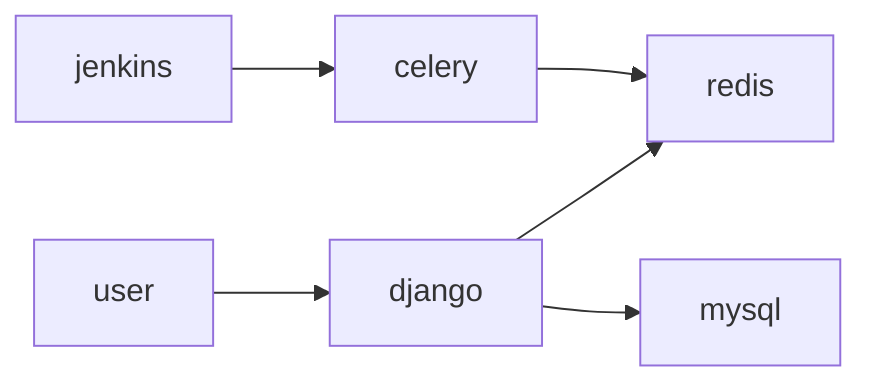

## 组织架构




# 任务发布工作原理

- 生产任务到redis
- celery监听到后消费事件
- celery模版渲染 打压缩包，通过配置模版调用jenkins创建任务
- jenkins 解压包执行包内容
# 支持任务
- 定时任务
- 一次性任务
- 主动任务 就是去jenkins 执行任务然后去控制机器
- 被动任务 就是jenkins注册任务 然后机器watch消费

## 注册任务

然后在 平台通过jenkins执行脚本你注册任务
```bash
cat >consumption_task.py<<EOF
from task import download_package

download_package.apply_async(args=["{{ version }}-{{ task_name }}.zip", "cd dir && ls -l && sh ./hello.sh"], queue="{{ host.ip }}", routing_key=None)

EOF
python3.9 task_run.py

```

## 消费任务
```bash
cat >> register_task.py<<EOF
import requests
import zipfile
from celery import Celery
import subprocess
local_app = Celery(
    "demo",
    backend="redis://:xxx@cmdb.keli.vip:6379/5",
    broker="redis://:xxx@cmdb.keli.vip:6379/6",
)
@local_app.task
def download_package(name,command):
    # 设置请求参数
    url = "http://xxx/DeployCen/Download/"
    headers = {"Accept": "application/json", "Content-Type": "application/json"}
    auth = ("admin", "xxx")
    data = {"name": name}
    # 发送请求
    response = requests.post(url, headers=headers, auth=auth, json=data)
    # 保存响应的内容到文件
    with open(name, "wb") as f:
        f.write(response.content)
    # 解压文件
    with zipfile.ZipFile(name, "r") as zip_ref:
        zip_ref.extractall("dir")
        # 执行命令并捕获输出结果
        output = subprocess.check_output(command, shell=True)
        # 输出结果
        print("===执行shell",output.decode())
EOF
celery -A task worker -Q "103.63.139.191" --loglevel=info
```


# 安装部署
安装jenkins 和上传file-parameters.hpi插件安装后 后执行以下操作,file-parameters.hpi在jenkins下

```bash
apt-get install make 
make install
mv update.sh /
sh /update.sh
```


# dws_cmdb_v2
